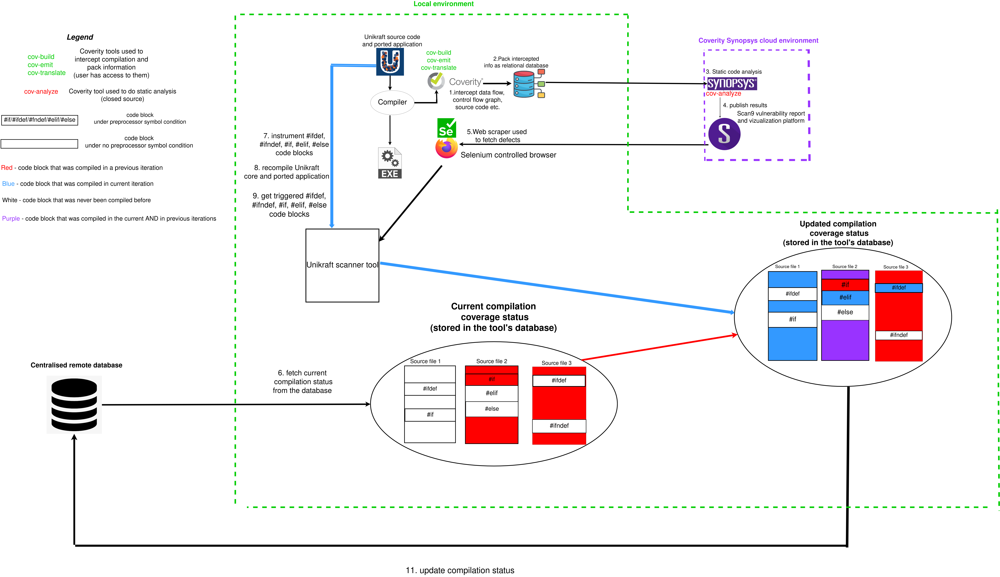

# Unikraft Scanner 

Unikraft Scanner is a tool intended for developers, that solves issues regarding the scanning coverage when using third-party static code analysis security tools on the Unikraft repo.  

Static code analysis tools, such as Coverity or CodeQL, intercept the compilation stage of the target project, extract various information about the compiled code, build a database out of different compiler generated low-level representations and finds possible vulnerabilities by querying the database for malicious patterns. Thus, only compiled code is guaranteed to be analyzed. 

However, Unikraft is made of multiple loosely-coupled C modules that can be chosen to be compiled or not depending on the top-level application's requirements, ported to run over the Unikraft unikernel. This means that the Unikraft code repo is not a single compilation target but multiple mutations that can have missing various modules that are not critically required by the application (for example we do not need the unikernel scheduler module if the application is proven to be single-threaded). Such modules are represented by 1 or more C source files compiled into a single object file. 

Unfortunately, besides C source files that may not be compiled in the current iteration, a compiled C source file is not guaranteed to have been fully compiled since there may be statements such as `#if`, `#elif`, `#else`, `#ifndef`, `#ifdef` that rely on various symbols and can deny nesting code to be compiled.  

In order to fully scan the Unikraft codebase we need to trigger compilation of all core modules, in an incremental way (multiple retries where we configure differently the unikernel for novel mutations).

 

# Features 

1. Identifies compiled C source files for a chosen Unikraft ported application. 

2. Parses compiled C source files and discovers what code blocks are conditioned by `#if`, `#elif`, `#else`, `#ifndef`, `#ifdef`, finally finding how many were also compiled. 

3. Provides visualization (using a similar output as the Unix `tree` tool) of what code regions were compiled and in what circumstances. 

4. Register a new Unikraft app iteration which may add or not new compiled regions in the central database. 

5. Semi-automatic upload of compiled code to the Coverity Scan cloud for static analysis 

A snapshot of how the compilation/scanning status is presented can be seen in the image below (green means compiled code, red otherwise). 

 

# Core Concepts 

# Prerequisites And Configuration 

In order to run this tool you will need: 

1. Install Python 3.8 or above. 

2. Install Python libraries mentioned in `src/requirements.txt`. It is advised to configure a Python virtual environment (venv) that includes these dependencies.

3. Make an account for `https://scan.coverity.com`. Right now, Github authentication for Coverity is NOT supported when using Unikraft Scanner ! 

4. Request `Maintainer` role for the Coverity project `https://scan.coverity.com/projects/unikraft-scanning?tab=overview`.

5. Once request is accepted, go to `https://scan.coverity.com/projects/unikraft-scanning/builds/new` and get the Coverity upload API token (should be after the -token=... parameter in the curl commands).

 

6. Request from project owner, through Discord, new credentials for interacting with the centralised database which collects information regarding all registered Unikraft compilations.

7. Download the Coverity build tools suite (`cov-build`, `cov-emit`, `cov-translate` etc.) from `https://scan.coverity.com/download/cxx/linux64`. These tools solve the steps from 1 and 2 from the `Core Concepts` diagram. Make sure that `$PATH` has the location where the suite is downloaded to! 

8. Create/Reuse a configuration file based on the examples found in `src/tool_configs`. File `config_<x>.yaml` represents the version X of the configuration schema. It is advised to use the latest version schema when using the tool. 

9. Save credentials such as Coverity submit token from step 5 and database credentials from step 6 under environment variables as in the configuration file. It is recommended to export such environment variables using ~/.bashrc so they will be available in any console session. 

10. Modify the rest of the configuration file to your liking.

11. Install `GeckoDriver` using instructions from https://askubuntu.com/questions/870530/how-to-install-geckodriver-in-ubuntu.

# Usage 

Source code is found in `src/`. Tool main usage is through `src/coverage.py`. 

View logging information in the file specified by `logfile` option from the config file 

View tool output in the file specified by `outfile` option from the config file. Output may be too large for console output. 

Add/register a new app in order to increase compilation/scan coverage: 

`python3 coverage.py app add -s <path to yaml config file from step 8> -a <path to a Unikraft app (you can use the ones compatible with catalog)> -t <tag/description (for multi-word put it between double quotes) UNIQUE to both the local DB and Coverity platform> -c <kraft compilation command>` 

If operation was successful, view application's source files, their compilation coverage, code blocks and defects found by static analysis using: 

`python3 coverage.py app view -s <path to yaml config file from step 8> -t <tag used the registering operation>` 

Look in the output file to view statistics. 