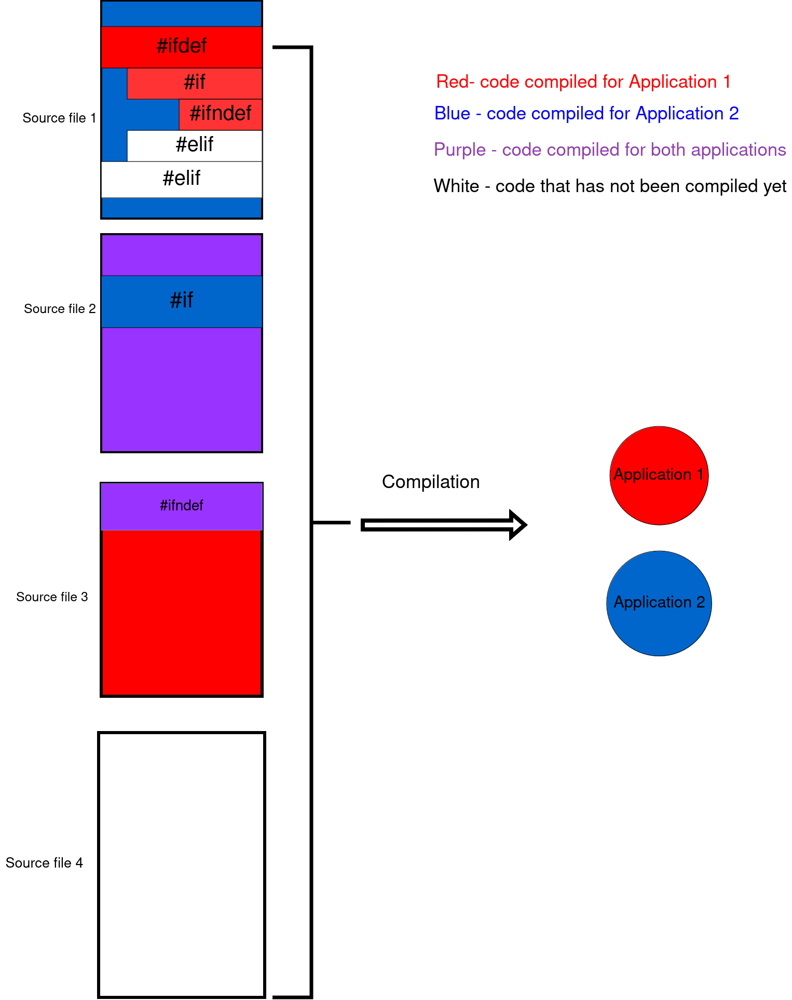

# Unikraft Scanner

Unikraft Scanner is a tool intended for developers that solves issues regarding the scanning coverage of third-party static code analysis security tools on the Unikraft repo. 

Coverity or CodeQL (popular static code analysis tools) somehow intercept the compilation process of the targeted codebase.

In order to fully scan the Unikraft codebase we need to trigger compilation (in an incremental way) of all core modules.

This tool provides features such visualizing (using a similar output of the `tree` tool) the current compilation status of the local Unikraft repo, or registering a new compilation process that will widen the global compilation status.

In addition, this tool can find blocks of code under `#if`, `#elif`, `#else`, `#ifndef`, `#ifdef` statements that can also change the compilation coverage (for example Unikraft Scanner found that a source file is involved in the compilation process but we are not sure if the all of it is compiled since there may be unsatisfied preprocessing condition statements).

The issue of compilation coverage and not having a way to visualize what code regions of the Unikraft codebase are analyzed, is shown below.

# Core Concepts

# Prerequisites And Configuration

In order to run this tool you will need:
1. Python 3.8 or above.
2. Python libraries mentioned in `src/requirements.txt`. It is advised to configure a Python virtual environemnt (venv) that includes this dependencies.
3. Run a local MongoDB database instance. The Dockefile placed in the root directory can be used for this step.
4. A valid account for `https://scan.coverity.com`. You can create it using your Github account.
5. Request `Maintainer/Wwner` role for the Coverity project #TODO
6. Once request is accepted, go to `https://scan.coverity.com/projects/unikraft-scanning/builds/new` and get the Coverity upload API token (should be after the -token=... parameter in the curl commands)

7. Create your own configuration file based on the examples found in `src/tool_configs`. File `config_<x>.yaml` represents the version X of the configuration schema. It is advised to use the latest version schema when using the tool.

